# REST API implementation using Django Framework

Outcomes from this module included:

- Developed an understanding of the requirements' analysis process
- Introduced to systems design concepts such as use cases/sequence diagrams/class diagrams
- Created basic UML diagrams
- Applied SOLID principles using MVT (Mode, View and Template) architectural pattern
--------------------------------------------------------------------------------
# Vision and Scope for Task Manger Application

## Business Requirements 
### Background
To organize your tasks, estimate and schedule them, keep track
of dependencies, resources, and milestones, and help you decide 
whether to adjust their priority, task management software is employed.
This application provide many advantages as follows:

- Tasks prioritization.
- Task scheduling.
- Task traceability.

### Business Objectives

- Minimize time which is spent to remember what and when to do your tasks.
- Minimize cost (no need to use papers, missing tasks which leads to lose your customers or business )
- Minimize paper manual work.

### Vision Statement

For users who are working in different business fields, tha task manager 
software is a smart and effective web application that will help 
to automate all the tasks scheduling and prioritization. Unlike the current 
situation, in which the users use papers to record and schedule their 
tasks. With task manager software the users can easily record and track 
their work and responsibilities so as a result they can minimize 
using papers and missing tasks.

### Scope and Limitations
#### Main Feature:

- Creating new tasks
- Updating already existing tasks
- Deleting tasks
- Importing tasks from external files.

### User Requirements

- Creating a task:
A user should be able to create a new task by making a POST request to the API 
with the task's title, start date and end date. The API should validate the request payload 
and return a response indicating whether the task was created successfully.
- Retrieving tasks: 
A user should be able to retrieve their list of tasks by making a GET request to the API. 
The API should return a list of all tasks, sorted by due date and Paginated.
- Updating a task:
A user should be able to update a task by making a PUT request to the API with the 
task's ID and any updated information (e.g., title, start date, end date). 
The API should validate the request payload and return a response indicating whether the update was successful.
- Deleting a task: A user should be able to delete a task by making a DELETE request to 
the API with the task's ID. 
The API should return a response indicating whether the delete was successful.
- Import endpoint: the user should be apple to upload a csv file where each row 
contains three columns that represent the task title , 
start date and end date respectively, and insert that to the system database.

### Specification

- The system shall enable the user to create new task item which 
include task title, start date and due date.
- The system shall enable the user to view all the tasks that are 
stored in the database.
- The system shall enable the user to update a particular task including 
updating title, start or due dates and the system will store and 
record these changes.
- The system shall enable the user to delete a specific task and system 
will remove the task from the storage.
- The system shall enable the user to upload CSV file which 
 contains the task title, start and due dates and the 
 system will store these data into the storage.

### Diagram:
- **Use Diagram:**

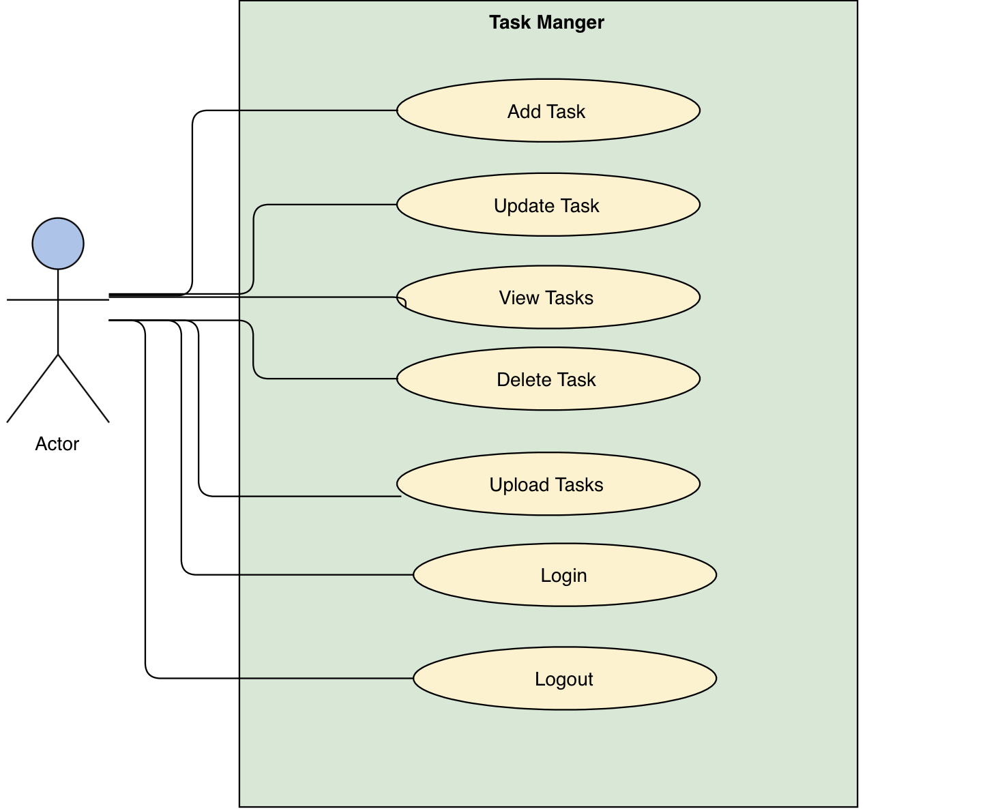

- **Activity Diagram:**


### Non-Functional Requirements
- The system must be  maintainable.
- The system must be higher reliability.

--------------------------------------------------------------------------------
# Selected Technologies
## Django:
Django is a high-level Python web framework that enables rapid development 
of secure and maintainable websites. Built by experienced developers, 
Django takes care of much of the hassle of web development, 
so you can focus on writing your app without needing to reinvent the wheel.
It is free and open source, has a thriving and active community, great documentation, 
and many options for free and paid-for support [1]. 

### MVT design pattern in Django
Django is built based on Model-View-Template (MVT) architecture. 
MVT is a software design pattern for developing a 
web application. It consists of the following three entities [2]:
1. Model
2. View
3. Template

- ### Model
A Model is an object that defines the structure of the data in the Django application.
It is responsible for maintaining the entire application’s data for which it provides various mechanisms to add, update, read and delete the data in the database.
 
- ### View
A View is a handler function that accepts HTTP requests, processes them, and returns the HTTP response.
It retrieves the necessary data to fulfill the request using Models and renders them on the user interface using Templates.
It can also create an HTML page using an HTML template dynamically, and populate it with data fetched from the model.

- ### Template
A Template is a text file that defines the structure or layout of the user interface. The text file can be any type of file; for example HTML, XML, etc.
It can accept data from the view and render it using jinja syntax.

#### Control flow in MVT architecture: 
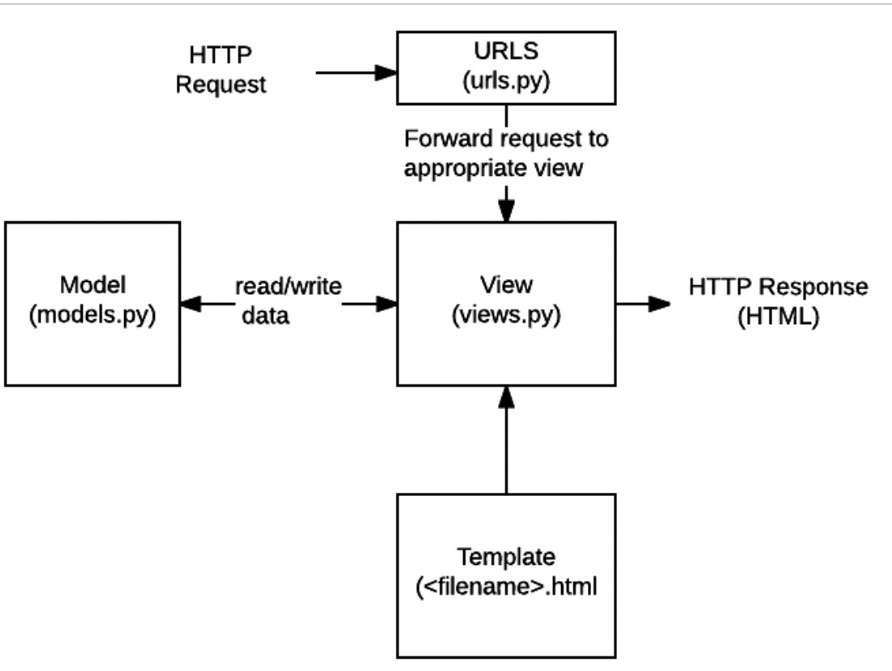
1. The user interacts with a Django application using a URL that is passed
   to the MVT architecture. A URL mapper is used to redirect the requests to the appropriate view based on the request URL.
2. If an appropriate view is found, it will be invoked.
3. The View will interact with the Model and retrieve the necessary data from 
   the database via Model.
4. The View will render an appropriate template along with the retrieved data
   to the user.

### ORM (Object Relational Mapper)
The Django web framework includes a default object-relational mapping layer (ORM) that can be used to interact with data from various relational databases such as SQLite, PostgreSQL, and MySQL. Django allows us to add, delete, modify and query objects, using an API called ORM. ORM 
stands for Object Relational Mapping [5].

## Bulma: 
Bulma is a free, open source framework that provides ready-to-use frontend components that you can easily combine to 
build responsive web interfaces [3].

## Database (SQLite file):
After the analysis for the system requirement, I found that the application is very 
simple we can use SQLite file which is A database that is created on one machine can be copied and used on a different 
machine with a different architecture [4]. On the other hand if the requirement are more complicated 
in this case we can use Postgres or another type of databases based on the use case 
,volume of data that should be stored and also the number of users who will use the system 
Based on the analysis there will be table for the task which contains (task title, 
start date, due data and description)


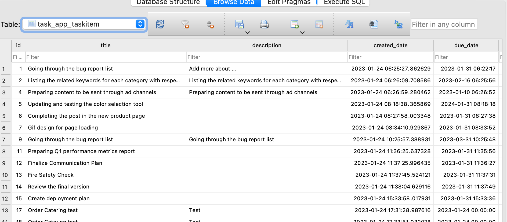

## APIs - Implementation

```python
"""
from django.urls import path
from . import views
urlpatterns = [
    path("", views.ItemListView.as_view(), name="index"),
    path("task/add/", views.ItemCreate.as_view(), name="task-add"),
    path("task/<int:pk>/", views.ItemUpdate.as_view(), name="item-update", ),
    path("task/<int:pk>/delete/", views.ItemDelete.as_view(), name="task-delete"),
    path("tasks/<int:page>", views.listing, name="task-by-page"),
    path("task.json", views.listing_api, name="task-api"),
    path('upload/', views.UploadView.as_view()),
]
```
### Create Task: 
The following url is used 
 ```python
""" 

 path("task/add/", views.ItemCreate.as_view(), name="task-add"),

"""
```

https://user-images.githubusercontent.com/27667600/214920899-afac83f0-e5f1-4efa-b6ab-68d5a267af0a.mp4


 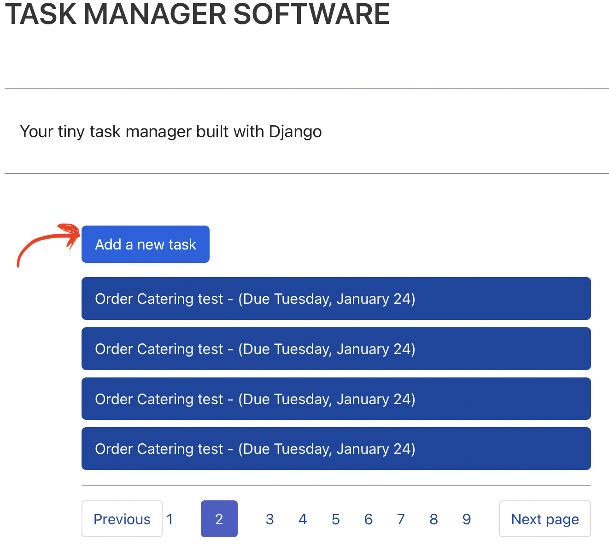

#### Then the following form will be opened
 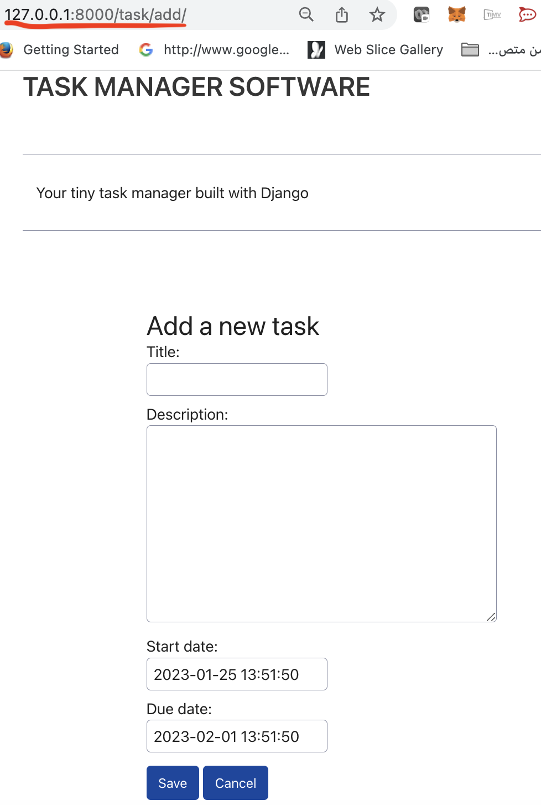


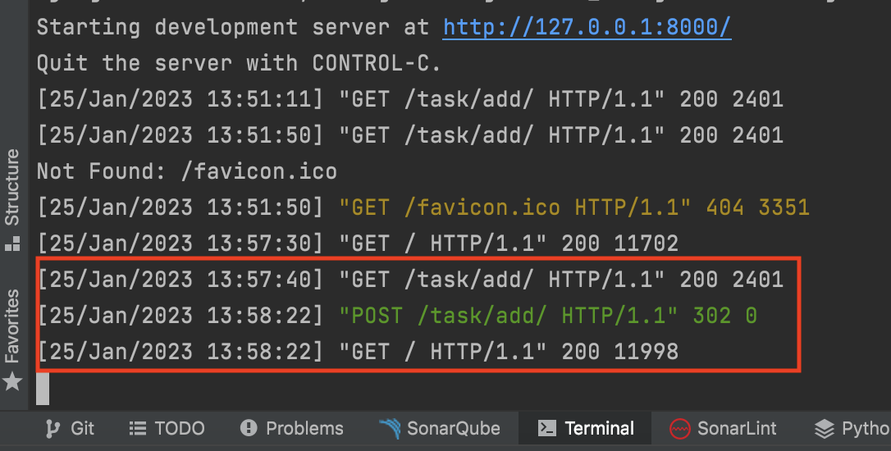

- View Tasks
It will be the default url

 ```python
""" 

 path("", views.ItemListView.as_view(), name="index"),
  path("tasks/<int:page>", views.listing, name="task-by-page"),
"""
```


https://user-images.githubusercontent.com/27667600/214918378-b7740331-b568-480b-9ec7-837efcde253d.mp4


As noticed tha tasks are sorted based on the due date by using order by in Meta class
as follows:
 ```python
""" 

 class TaskItem(models.Model):
    title = models.CharField(max_length=100)
    description = models.TextField(null=True, blank=True)
    created_date = models.DateTimeField(auto_now_add=True)
    start_date = models.DateTimeField(default=timezone.now)
    due_date = models.DateTimeField(default=one_week_hence)

    def get_absolute_url(self):
        return reverse(
            "index", args=[]
        )

    def __str__(self):
        return f"{self.title}: due {self.due_date}"

    class Meta:
        ordering = ["due_date"]

"""
```

### Update Task

 ```python
""" 
 path("task/<int:pk>/", views.ItemUpdate.as_view(), name="item-update", ),
"""
```
#### The user can click on the task and the following form will be opened to enable the user 
#### update the task data

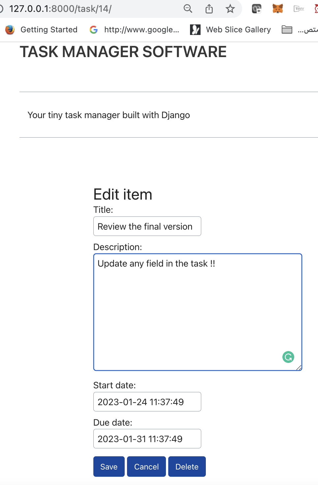


### Delete Task

 ```python
""" 
 path("task/<int:pk>/delete/", views.ItemDelete.as_view(), name="task-delete"),
"""
```
#### The user can click on any task and then click on the delete button as follows:
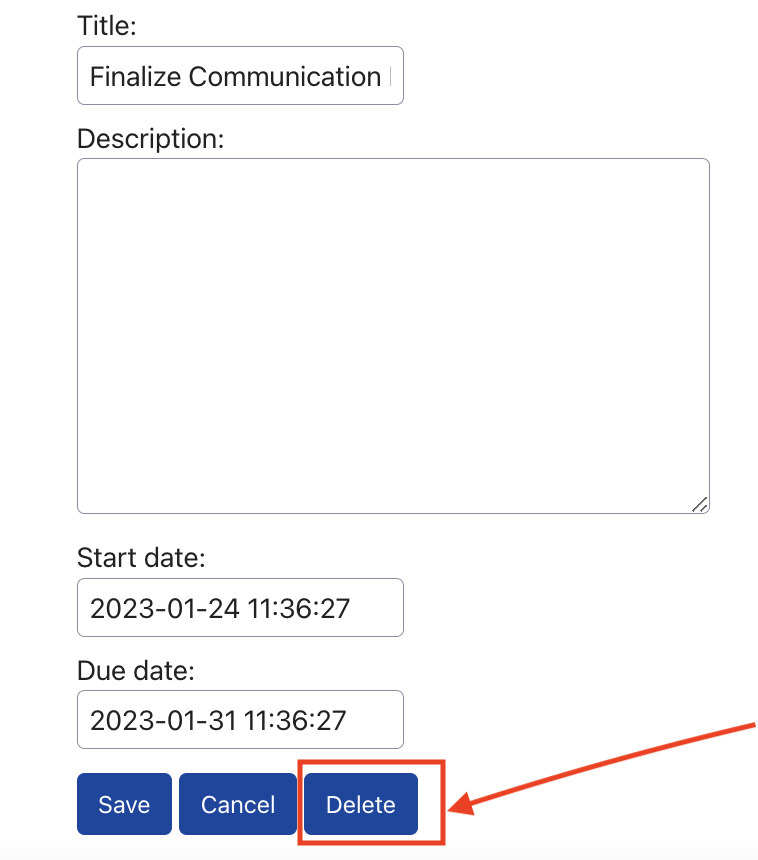

#### Then a confirmation massage form will appear for the user to confirm that the task will be deleted
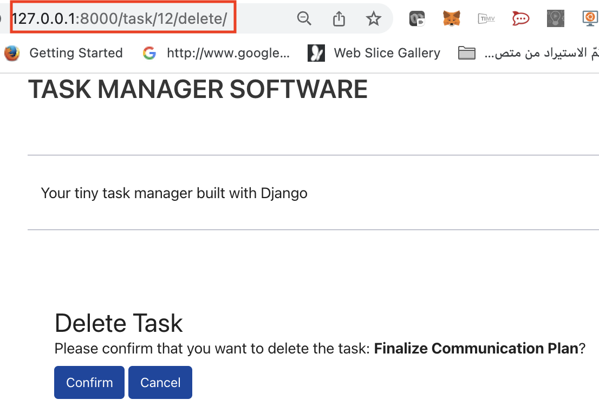


### Upload CSV File

 ```python
""" 
 path('upload/', views.UploadView.as_view()),
"""
```
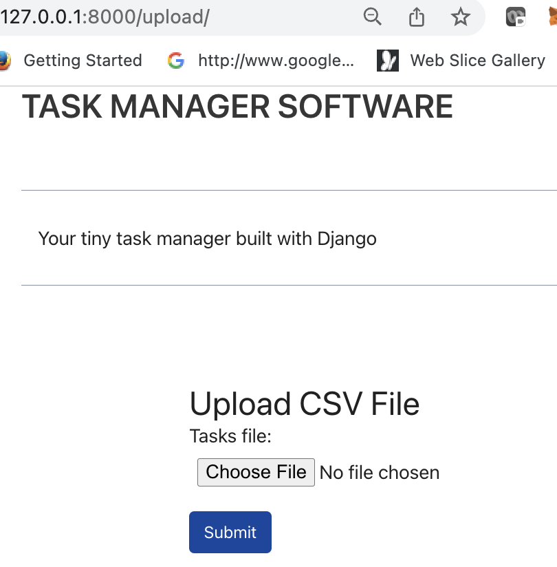

The use can click on choose file and upload the CSV file.

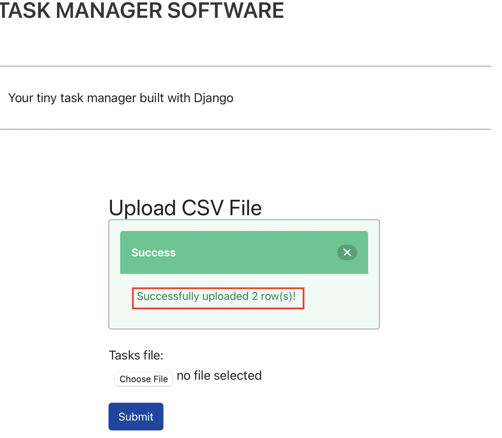

If there is a mistake then the system return error message for the user

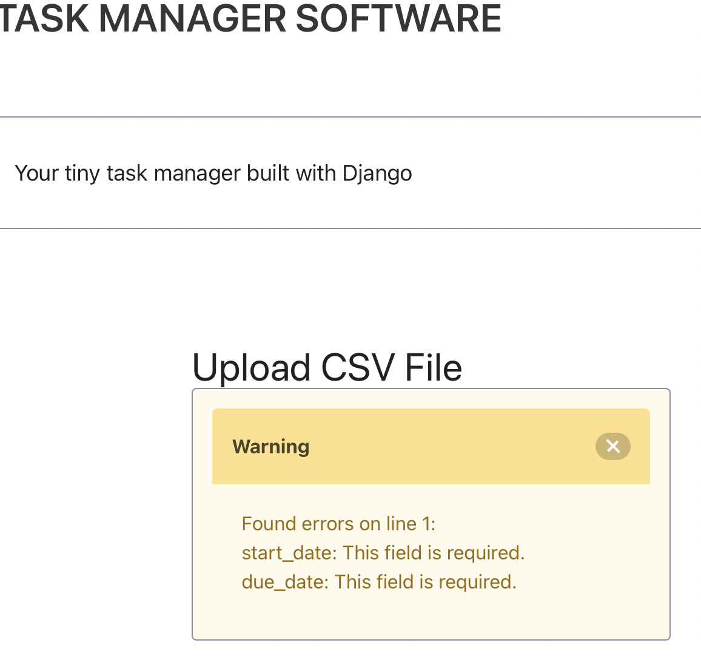


--------------------------------------------------------------------------------

## Testing


Sample of unit tests that are built:

```python
"""

from django.test import TestCase
from .models import TaskItem


class ModelsTestCase(TestCase):

    def test_string_method(self):
        task = TaskItem.objects.get(id=1)
        expected_string = f"Name: {task.title} {task.start_date}"
        self.assertEqual(str(task), expected_string)

    def test_get_absolute_url(self):
        task = TaskItem.objects.get(id=1)
        self.assertEqual(task.get_absolute_url(), "/task/1")

"""
# To run the test. You can use the following commands:
 python manage.py test 
```
## Example
The following example from the run:
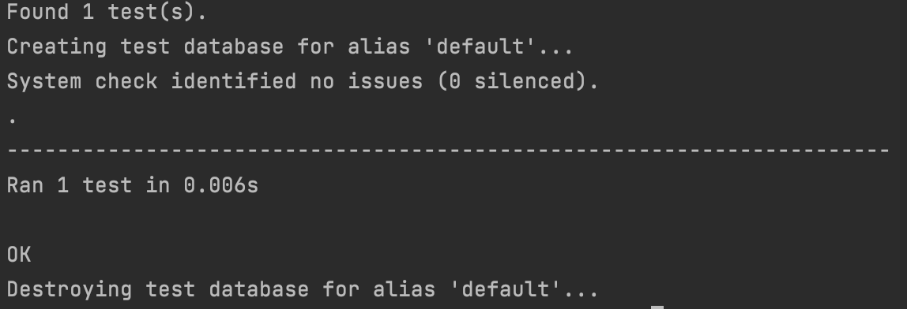


## References
- [1] https://developer.mozilla.org/en-US/docs/Learn/Server-side/Django/Introduction
- [2] https://www.educative.io/answers/what-is-mvt-structure-in-django
- [3] https://bulma.io
- [4] https://www.sqlite.org/onefile.html
- [5] https://www.scaler.com/topics/django/django-orm/


